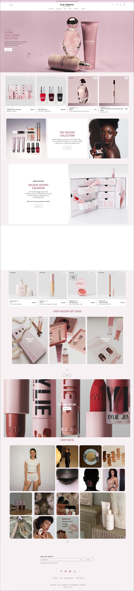
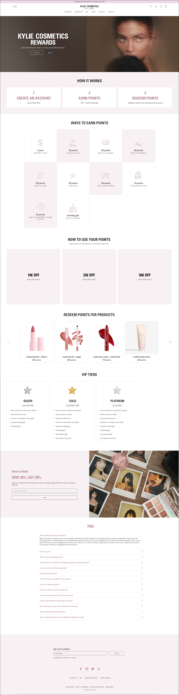
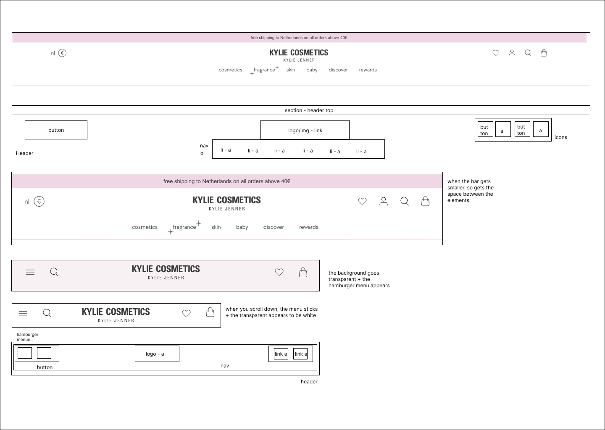
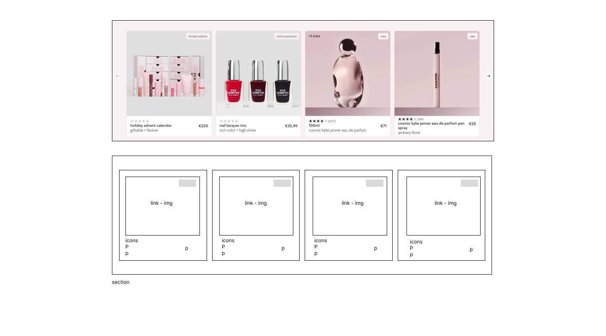
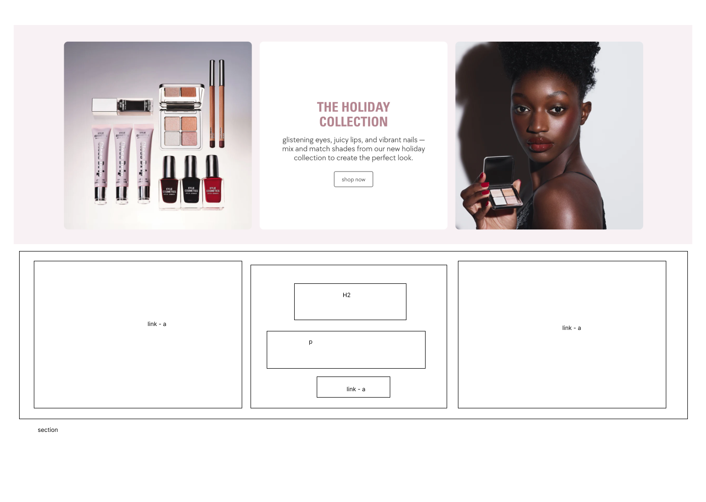
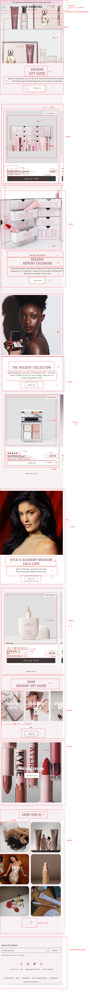
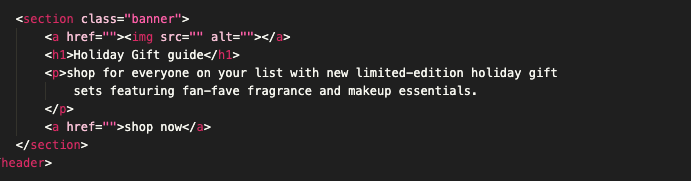

# Procesverslag
Markdown is een simpele manier om HTML te schrijven.  
Markdown cheat cheet: [Hulp bij het schrijven van Markdown](https://github.com/adam-p/markdown-here/wiki/Markdown-Cheatsheet).

Nb. De standaardstructuur en de spartaanse opmaak van de README.md zijn helemaal prima. Het gaat om de inhoud van je procesverslag. Besteedt de tijd voor pracht en praal aan je website.

Nb. Door *open* toe te voegen aan een *details* element kun je deze standaard open zetten. Fijn om dat steeds voor de relevante stuk(ken) te doen.

## Jij

  
uitwerken voor kick-off werkgroep

  ### Auteur:
  Kim van Zuilen

  #### Je startniveau:
  Rood

  #### Je focus:
  Surface plane
 

## Je website

  
uitwerken voor kick-off werkgroep

  ### Je opdracht:
  https://kyliejennercosmetics.eu/en-nl

  #### Screenshot(s) van de eerste pagina (small screen): 
  

  #### Screenshot(s) van de tweede pagina (small screen):
  
 

## Toegankelijkheidstest 1/2

  
uitwerken na test in 2e werkgroep

  ### Bevindingen
  Ik heb het onderzoek samen met Belle uitgevoerd.
  De images van mijn van bevindingen : 
  
    
      
        
          

  ### Belangrijkste bevindingen
  Uit mijn onderzoek is gebleken dat de reader niet goed werkt in de pagina,
  want hij gaat het hele menu langs, ook als het menu niet is uitgeklapt. Dit is niet
  erg gebruiksvriendelijk want dan moet de gebruiker super lang wachten voordat de juiste 
  informatie wordt opgenoemd!

 - Images hebben niet overal beschrijvingen of de alts worden niet goed beschreven bij de content
 - Veel fouten in de validator 
 - Alles op mobiel ziet er goed uit, maar als je op de website telefoon niveau doet,
 ziet het er raar uit!
 - Maakt alleen gebruik van h2, geen goede ordening van de headings
 - De video op de pagina kan je niet zelf stoppen
 - geen dark mode omdat alles in het roze is

        
 

## Breakdownschets

  
uitwerken na afloop 3e werkgroep

   

 ### Breakdowns before feedback: 

  #### dynamisch deel (bijv menu): 
  

  #### wellicht nog een dynamisch deel (bijv filter): 

 ### Breakdowns after feedback: 
 #### de hele pagina: 
 
 

## Voortgang 1

  
uitwerken voor 1e voortgang

  ### Stand van zaken
  In de eerste week had ik veel vooruitgang geboekt met mijn website, maar in de tweede week had ik een 
  deadline van een ander vak waarom ik iets minder had uitgewerkt van de Html en css code.

  Wel had ik een goed begin gemaakt aan de breakdown schetsen en de opbouw van de html. 
  Wat ik lastig vond, was dat ik gewend ben om gebruik te maken van Classes. In de klas werd uitgelegd
  dat er geen gebruik hiervan gemaakt mag worden, dus hier moet ik wel echt aan gaan wennen. 

  Ik had in mijn code wel gebruik gemaakt van classes dus dit moet ik veranderen voordat ik verder ga met
  mijn css code! 

  
  

  ### Verslag van meeting
 In de meeting heb ik aangegeven dat ik het lastig vind om zonder classes te werken. 
 De studentbegeleider heeft een paar voorbeelden laten zien zoals;
 - nth of type 
 - has()
 Dus ik ga deze opties zeker uitproberen 

Ook vond hij de opstelling van mijn Html niet helemaal goed dus dit moet ik gaan aanpassen!

## Voortgang 2 

  
uitwerken voor 2e voortgang

  ### Stand van zaken
  Wat heb ik tot nu toe gedaan:
  - breakdown schetsen aangepast, meer gebruik gemaakt van lists, geen classes, beter gebruik van sections & articles
  - Html code volledig gemaakt voor beide pagina's
  - Css styling van navigatie (nog niet volledig)
  - Css styling van footer (nog niet perfect)
  - Css general styling 
  - Css geoefent met nth-of-type, last-of-type, custom properties enzv

 ### Verslag van meeting
 (uitkomsten van de meeting)

## Toegankelijkheidstest 2/2 

  
uitwerken na test in 9e werkgroep

  ### Bevindingen
  Lijst met je bevindingen die in de test naar voren kwamen (geef ook aan wat er verbeterd is):

## Voortgang 3 

  
uitwerken voor 3e voortgang

  ### Stand van zaken
  hier dit ging goed & dit was lastig (neem ook screenshots op van delen van je website en code)

  ### Agenda voor meeting
  samen met je groepje opstellen

  | student 1      | student 2          | student 3    | student 4        |
  | ---            | ---                | ---          | ---              |
  | dit bespreken  | en dit             | en ik dit    | en dan ik dat    |
  | en dat ook nog | dit als er tijd is | nog een punt | dit wil ik zeker |
  | ...            | ...                | ...          | ...              |

  ### Verslag van meeting
  hier na afloop snel de uitkomsten van de meeting vastleggen

  - punt 1
  - punt 2
  - nog een punt
  - ...

## Eindgesprek 

  
uitwerken voor eindgesprek

  ### Je uitkomst - karakteristiek screenshots:
  

  ### Dit ging goed/Heb ik geleerd: 
  Korte omschrijving met plaatjes

  

  ### Dit was lastig/Is niet gelukt:
  Korte omschrijving met plaatjes

  

## Bronnenlijst

  
continu bijhouden terwijl je werkt

  Nb. Wees specifiek ('css-tricks' als bron is bijv. niet specifiek genoeg). 
  Nb. ChatGpT en andere AI horen er ook bij.
  Nb. Vermeld de bronnen ook in je code.

  1. bron 1
  2. bron 2
  3. ...

