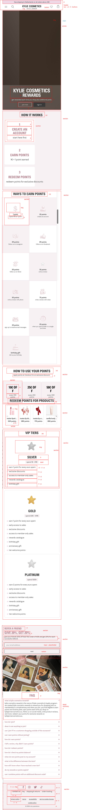

# Procesverslag
Markdown is een simpele manier om HTML te schrijven.  
Markdown cheat cheet: [Hulp bij het schrijven van Markdown](https://github.com/adam-p/markdown-here/wiki/Markdown-Cheatsheet).

Nb. De standaardstructuur en de spartaanse opmaak van de README.md zijn helemaal prima. Het gaat om de inhoud van je procesverslag. Besteedt de tijd voor pracht en praal aan je website.

Nb. Door *open* toe te voegen aan een *details* element kun je deze standaard open zetten. Fijn om dat steeds voor de relevante stuk(ken) te doen.

## Jij

  
uitwerken voor kick-off werkgroep

  ### Auteur:
  Kim van Zuilen

  #### Je startniveau:
  Rood

  #### Je focus:
  Surface plane
 

## Je website

  
uitwerken voor kick-off werkgroep

  ### Je opdracht:
  https://kyliejennercosmetics.eu/en-nl

  #### Screenshot(s) van de eerste pagina (small screen): 
  

  #### Screenshot(s) van de tweede pagina (small screen):
  
 

## Toegankelijkheidstest 1/2

  
uitwerken na test in 2e werkgroep

  ### Bevindingen
  Ik heb het onderzoek samen met Belle uitgevoerd.
  De images van mijn van bevindingen : 
  
    
      
        
          

  ### Belangrijkste bevindingen
  Uit mijn onderzoek is gebleken dat de reader niet goed werkt in de pagina,
  want hij gaat het hele menu langs, ook als het menu niet is uitgeklapt. Dit is niet
  erg gebruiksvriendelijk want dan moet de gebruiker super lang wachten voordat de juiste 
  informatie wordt opgenoemd!

 - Images hebben niet overal beschrijvingen of de alts worden niet goed beschreven bij de content
 - Veel fouten in de validator 
 - Alles op mobiel ziet er goed uit, maar als je op de website telefoon niveau doet,
 ziet het er raar uit!
 - Maakt alleen gebruik van h2, geen goede ordening van de headings
 - De video op de pagina kan je niet zelf stoppen
 - geen dark mode omdat alles in het roze is

        
 

## Breakdownschets

  
uitwerken na afloop 3e werkgroep

 ### Breakdowns before feedback: 

  #### dynamisch deel (bijv menu): 
  

  #### wellicht nog een dynamisch deel (bijv filter): 

 ### Breakdowns after feedback: 
 #### de hele pagina: 
 
 

## Voortgang 1

  
uitwerken voor 1e voortgang

  ### Stand van zaken
  In de eerste week had ik veel vooruitgang geboekt met mijn website, maar in de tweede week had ik een 
  deadline van een ander vak waarom ik iets minder had uitgewerkt van de Html en css code.

  Wel had ik een goed begin gemaakt aan de breakdown schetsen en de opbouw van de html. 
  Wat ik lastig vond, was dat ik gewend ben om gebruik te maken van Classes. In de klas werd uitgelegd
  dat er geen gebruik hiervan gemaakt mag worden, dus hier moet ik wel echt aan gaan wennen. 

  Ik had in mijn code wel gebruik gemaakt van classes dus dit moet ik veranderen voordat ik verder ga met
  mijn css code! 

  
  

  ### Verslag van meeting
 In de meeting heb ik aangegeven dat ik het lastig vind om zonder classes te werken. 
 De studentbegeleider heeft een paar voorbeelden laten zien zoals;
 - nth of type 
 - has()
 Dus ik ga deze opties zeker uitproberen 

Ook vond hij de opstelling van mijn Html niet helemaal goed dus dit moet ik gaan aanpassen!

## Voortgang 2 

  
uitwerken voor 2e voortgang

  ### Stand van zaken
  Wat heb ik tot nu toe gedaan:
  - breakdown schetsen aangepast, meer gebruik gemaakt van lists, geen classes, beter gebruik van sections & articles
  - Html code volledig gemaakt voor beide pagina's
  - Css styling van navigatie (nog niet volledig)
  - Css styling van footer (nog niet perfect)
  - Css general styling 
  - Css geoefent met nth-of-type, last-of-type, custom properties enzv

 ### Verslag van meeting
 Gepsrek gevoerd met Danny
 Mijn vooruitgang was positief, wel waren er een paar (kleine) dingetjes waar ik nog wel tijd aan moet besteden!
 De punten waar ik aandacht aan moet besteden:
 - headings aanpassen
 - grid oefenen maken en dit toevoegen aan website 
 - Grid in navigatie toepassen (als grid lukt) > grid met 8 lijnen
 - 5 punten uitkiezen voor surface plane
 - Dark mode hoeft niet per se zwart te zijn, maar dat ik wel kan aantonen dat ik weet hoe het werkt > goede mogelijkheid is om de donkere en lichte kleuren roze om te draaien!
 - micro interacties toevoegen
 - fish oefening voor grid 
 - codepen voor grid met een product, https://codepen.io/shooft/pen/yLKjzWa

## Wat is nieuw, wat is er veranderd?

  
Mijn aanpassingen 

  ### Wat is nieuw?
  Voor surface plane is 1 optie dark mode. Ik heb hiervoor andere kleuren roze uitgekozen.
  

  De 5 punten van surface plane:
  <ol>
  <li>1.Darkmode, custom properties aanpassen met js </li>
   <li>2. video/geluidje toevoegen "rise and shine"</li>
    <li>3. animatie "feedback" of "loading" </li>
     <li>4. (has)</li>
      <li>5. complete micro interacties, werkende hamburgermenu</li>
  </ol>

  #### 7 januari 2025
  Dagplanning: headings weghalen, fish grid toevoegen, micro interacties uitkiezen 
  Ik ben op deze dag alle opdrachten van grid nagelopen
   

## Voortgang 3 

  
uitwerken voor 2e voortgang

  ### Stand van zaken
  Wat heb ik tot nu toe gedaan:
  - Feedback verwerkt van vorige voortgangsgesprek : headings veranderd, custom properties aangevuld, surface plane 5 opties uitgekozen, ik heb meer gebruik gemaakt van unordered lists, geoefend met grid. 

  De punten waar ik tegenaan loop:
  Heb bijna de hele styling van pagina 1 af alleen pagina 2 is dan moeilijker te stijlen, hoe los ik dit op? Ik had voor nu voor de main van page 2 een class gebruikt. 

 ### Verslag van meeting
 Gepsrek gevoerd met Danny
 De vooruitgang was vrij positief. 

 De punten waar ik aan nog moet werken:
 - Voor surface plan zijn de 5 punten nu: 1. background kylie, 2. darkmode, 3.geluidje toevoegen, 4. gebruik van has(), 5. dialog transition toevoegen + de hamburgermenu micro interaction
 - Ik moet nog goed gaan kijken naar wat is article, section zodat het makkelijker is bij stylen. 
 - Buttons en general css code los zetten van andere extra stylingen, scheelt werk!
 - Class mag je wel gebruiken als het niet anders kan
 - Gebruik van class bij reward pagina > vip tiers, points 

  
Feedback verwerken 

  #### 10 januari 2025
  Dagplanning: 
  - General css styling losmaken van andere styling
  - Home page af stijlen 
  - 2 surface plane options afmaken 

  
 Styling van website 

  #### 13 januari 2025
  - Styling van allebei de pagina's afgemaakt 

  #### 14 januari 2025
  Ik heb vandaag nog een checklist gemaakt van dingen die nog gedaan moeten 
  worden voor vrijdag 15:00!

  Tijdens het coderen wist ik niet meer zeker in wat voor grootte telefoon ik moest nemen.
  Uit de opdracht kwam ik erachter dat ik voor een te grootte telefoon programmeerde, het moet namelijk voor Iphone SE, 375 x 667. 

## Toegankelijkheidstest 2/2 

  
uitwerken na test in 9e werkgroep

  
    
      
        
          

  ### Bevindingen
  De wcag list is uitgevoerd met Madelief. 1 van de vragen is zet je code in de code validator en ik ben toen erg geschrokken.
  Tijdens het coderen heb ik onbewust een paar domme fouten gemaakt met section, dit heb ik allemaal moeten oplossen!
       
  Ik heb de wcag list als houdvast gehad tijdens het coderen zoals;
  - video moet je kunnen pauseren 
  - ik heb audio toegevoegd
  - gebruik van headings 
  - gebruik van lists
  - images hebben alt 
  - gebruik van a voor links 
  - gebruik van buttons voor knoppen 

## Eindgesprek 

  
uitwerken voor eindgesprek

  ### Je uitkomst - karakteristiek screenshots:

  ### Dit ging goed/Heb ik geleerd: 
  Ik ben super blij met het eindresultaat van mijn website! Ik heb veel geleerd over het 
  gebruik van has(), werken met svg's, details, summary's, nth-of-type, last-type, first-type enzv. 
  
  Ik heb nog nooit gewerkt met een dialog, maar toen Danny het voorstelde vond ik dit een leuke
  toevoeging aan de website als surface plane optie!
  

  De articles gericht aan de producten heeft mij het meeste werk gekost. In het begin van de website
  ging ik de articles apart stylen. Dit kost veel tijd en werk, maar na een voortgangsgesprek kreeg ik de 
  feedback om ze als 1 article te stijlen. Dit heb ik uiteindelijk opgepakt en dit heeft mij veel tijd en moeite 
  bespaard. 
   
    

  ### Dit was lastig/Is niet gelukt:
  De virtual try out is een video. Ik had alle afbeelden, svg's, icons enzv gedownload van de website toen deze update er was met de holiday collection. Maar de video ben ik vergeten te downloaden. Ik heb nog online gezocht of ik het terug kon vinden, (op andere talen websites), maar omdat de holidays natuurlijk weg zijn, was deze niet vindbaar. 

  Ik ben op social  media gaan kijken en vond een video op instagram van Kylie cosmetics. Deze heb ik in web formaat gezet en de foto van virtual try out gebruikt als poster voor die video. Ik heb laten zien dat ik wel met video kan werken, maar het is dus niet de orignele video die erbij hoorde. 
  

  Deze virtual try out image lijkt op het probleem van hierboven. Ik heb het verkeerde formaat gedownload waardoor de sizing van de image niet gepast was voor de telefoon. Het was net de hele tijd niet mooi of te groot, te klein. 
  Ik heb online gezocht naar dezelfde image, maar deze was niet te vinden. Dus heb ik de stijling iets aangepast dan de originele styling van de image. 
  

## Bronnenlijst

  
Mijn bronnen

  1. https://codepen.io/kimvz/pen/jENxaBa dialog melding
  2. https://codepen.io/kimvz/pen/zxOpyrZ grid fish
  3. https://codepen.io/kimvz/pen/MYgrzNw grid columns
  4. https://dlo.mijnhva.nl/d2l/le/content/609316/viewContent/2344000/View  animatie button
  5.

